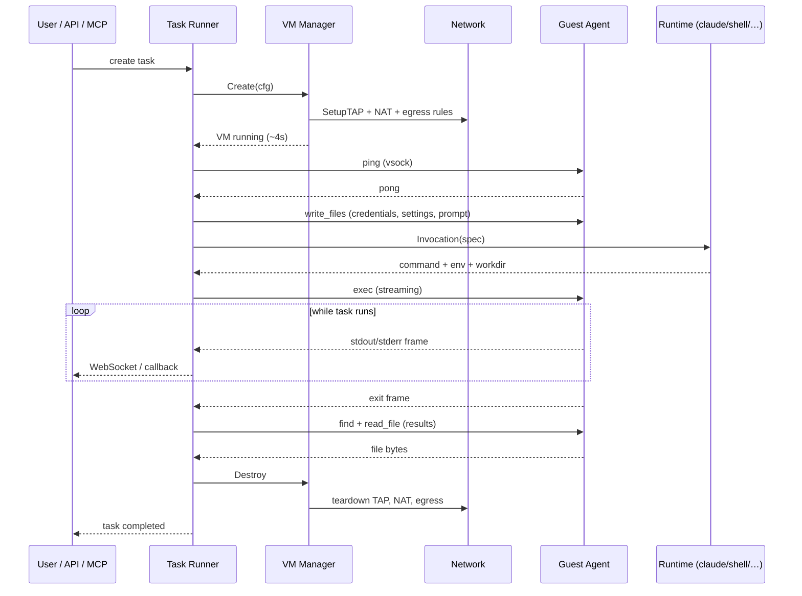

# Architecture

Orchestrator is two binaries: the **host** (`orchestrator`) and the **guest
agent** (`agent`, baked into the rootfs). Everything below is about how they
fit together.

```
┌─────────────────────────────────────────────────────────────┐
│ HOST PROCESS (runs as root)                                 │
│                                                             │
│  REST API + Web UI         MCP server           /metrics    │
│  (127.0.0.1:8080)          (127.0.0.1:8081)     (Prometheus)│
│         │                        │                          │
│         └──────────┬─────────────┘                          │
│                    │                                        │
│  ┌──── Task Runner ──── Runtime Registry ────┐              │
│  │       │                  ├── claude       │              │
│  │       │                  ├── shell        │              │
│  │       │                  └── (your plugin)│              │
│  │       │                                                  │
│  │       ├── VM Manager ──── jailer + firecracker           │
│  │       ├── Network Mgr ─── TAP + iptables NAT             │
│  │       ├── Stream Hub ──── WebSocket fan-out              │
│  │       ├── Event Sinks ─── webhook + audit log            │
│  │       └── Result Collector (files via vsock)             │
│  └───────────────────────────────────────────┘              │
└────────────────────────────────┬────────────────────────────┘
                                 │ vsock (no network!)
┌────────────────────────────────▼────────────────────────────┐
│ GUEST MicroVM (fresh per task, destroyed after)             │
│                                                             │
│  orchestrator-agent (systemd) ◄── vsock:9001                │
│     │                                                       │
│     ├── exec (buffered + streaming)                         │
│     ├── write_files / read_file                             │
│     └── Spawns the agent runtime (claude, shell, …)         │
└─────────────────────────────────────────────────────────────┘
```

## Host components

| Component | Package | Job |
|---|---|---|
| **VM Manager** | `internal/vm` | Full lifecycle: create, list, stop, destroy, state recovery from disk. Talks to the jailer binary. |
| **Network Manager** | `internal/network` | Creates TAP devices, programs iptables NAT + FORWARD rules, applies the egress allowlist. |
| **Rootfs injector** | `internal/inject` | Mounts the per-VM rootfs and writes the guest's systemd-networkd config and hostname before boot. |
| **Task Runner** | `internal/task` | End-to-end orchestration: create VM → inject context → dispatch runtime → stream output → collect files → destroy. |
| **Runtime Registry** | `internal/runtime` | Resolves `task.Runtime` ("claude", "shell", …) to a plugin that builds the invocation. |
| **Vsock client** | `internal/vsock` | Host-side AF_VSOCK wrapper (raw syscalls — Go stdlib doesn't expose `AF_VSOCK`). |
| **REST server** | `internal/api` | `go-chi` router, WebSocket streaming, embedded frontend. |
| **MCP server** | `internal/mcp` | stdio and Streamable-HTTP MCP, exposes `run_task`, `list_vms`, `get_task_status`, etc. |
| **Stream Hub** | `internal/stream` | Per-task 1000-entry ring buffer + fan-out to WebSocket subscribers. |
| **Auth middleware** | `internal/authn` | Bearer-token check, constant-time compare, `?token=` query for WebSocket upgrades. |
| **Rate limiter** | `internal/ratelimit` | Concurrency semaphore + token-bucket rate. |
| **Metrics** | `internal/metrics` | Prometheus text format: VM count, task count/durations, stream drops. |
| **Event sinks** | `internal/events` | Webhook (HMAC-signed) + JSON-lines audit log. |
| **Snapshot Manager** | `internal/snapshot` | `PauseVM` → pull memory/state files → tear down VM; `RestoreVM` to clone. |

## Guest agent

A static Go binary at `/usr/local/bin/agent` in the rootfs, started by a
systemd service. Listens on vsock port 9001 with a small RPC protocol:

| Op | Semantics |
|---|---|
| `ping` | Liveness probe. Succeeds within <100 ms of kernel boot. |
| `exec` (buffered) | Run a command, return stdout/stderr/exit after completion. |
| `exec` (streaming) | Run a command, frame stdout/stderr lines back as they come. Uses process groups so child forks are killed on exit. |
| `write_files` | Write a batch of files with modes. Used for context injection. |
| `read_file` | Read a single file. Used for result collection. |
| `signal` | Forward a Unix signal to a running child. |

The protocol is length-prefixed JSON frames over a vsock connection. The guest
doesn't care about networking — vsock is available before the guest's user
space has even brought up eth0.

## Communication channels

| Purpose | Channel | Why |
|---|---|---|
| Agent control | vsock (CID per VM, port 9001) | Kernel-to-kernel, no network stack, microsecond latency. Ready before guest networking. |
| Guest → internet | TAP device + iptables NAT | Each VM gets its own /24 subnet. Egress allowlist (when enabled) is FORWARD-chain iptables rules tagged with a per-TAP comment for clean teardown. |
| Host → REST API | HTTP/1.1 on port 8080 | Loopback by default, bearer auth on non-loopback. |
| Dashboard → task stream | WebSocket at `/api/v1/tasks/{id}/stream` | Backfills ring buffer on connect, then streams live events. |
| Webhook receiver | HTTP POST to operator-configured URL | HMAC-SHA256 signed body. |

## A task, start to finish



## Where state lives

| What | Where | Lifetime |
|---|---|---|
| VM metadata | `/opt/firecracker/vms/<name>/metadata.json` | Until destroy. Enables recovery across orchestrator restarts. |
| Jailer chroot | `/srv/jailer/firecracker/<name>/` | Until destroy. Contains rootfs, kernel, API socket. |
| Task results | `/opt/firecracker/results/<task-id>/` | Persistent. Clean up with `find … -mtime +N -delete`. |
| Audit log | `ORCHESTRATOR_AUDIT_LOG` (JSON lines) | Persistent. Rotate with logrotate. |
| Tasks in memory | In-process map in `task.Store` | Lost on restart. Use the audit log for historic records. |

The task store is **intentionally in-memory** — orchestrator is a single-host
tool and the in-memory store kept the dependency graph small. If you need
durable tasks across restarts, consume the audit log or wire a webhook to
your own DB.
